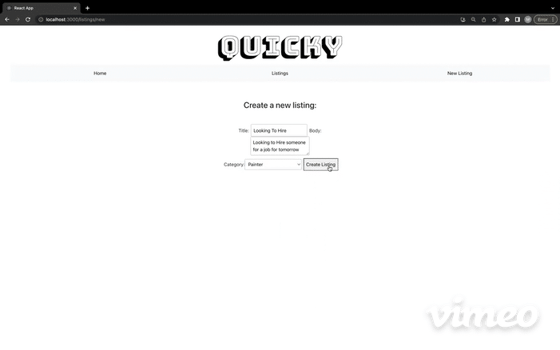

# Quicky

# Repository URL:
- Front-end: https://github.com/marskimiko/job-board-front-end
- Back-end: https://github.com/marskimiko/job-board-app

# Video Walkthrough:
https://www.youtube.com/watch?v=xL0QjJo62lU

# Blogpost about Quicky:
https://dev.to/marskimiko/how-to-make-a-full-stack-crud-app-with-react-and-a-ruby-sinatra-api-29ed 

# Project Philosophy: 

Quicky is a Job Board application for quick gigs. This application was inspired by my own life, specifically during my time at Flatiron School where I have been working freelance as a means to dedicate the majority of my time to learning instead of having to commit to a job. I often post on istagram when I am looking for quick PA work, or audio engineering work when I need extra money and thought there should be someone where artists and creatives could post.

# Features:

- The home page displays a description of the application, and instructs the user to click on the "Listings" link in the navigation in order to view all of the listings
- Upon clicking on "Listings" in the navigation there is a dropdown menu at the top of the page to allow you to sort the listings by category
- Below the dropdown menu is a form where users can create new categories
- Below the form is all of the listings which are displayed with a title, body, and category and have the ability to be edited as well as deleted
- If you would like to create a new listing click "New Listing" in the navigation which will take you to a form to fill out
- Once you are done filling out the form click "Create Listing" which will automatically take you to the "listings" page where you can see your new listing that you created

## How to Use:

**•** Click "Listings in the navigation to see all of the listings" 

**•** Use the dropdown menu to filter the listings by category

**•** Fill out the form and click "add" to create a new category

**•** Click the "edit" button to edit a listing

**•** Click the "save" button to save you edit

**•** If you want to delete a listing from the browser click the 🗑 button

**•** Click "New Listing" in the navigation to create a new listing

**•** Once you fill out the form click the "create listing" button which will take you back to the "Listings" page where you can see your new listing

## Description of app: 

This is a single page full-stack CRUD application that has a back-end that was creating using Ruby and a sinatra API which stores data which is then fetched from : http://localhost:9393/cats and http://localhost:9393/listings. The front-end was created using React and Javascript

On the front end the application uses a total of 9 components: App.js, Home.js, Navigation.js, Listings.js, Listing.js, New Listing.js, EditListing.js, NewCategory.js, and Filter.js

The application has 3 different client-side routes throughout it using React-Router: Home, Listings, and NewListing

Styling was done using CSS and Bootstrap

## Technologies used:

- React
- Javascript
- HTML
- CSS
- Bootstrap
- Ruby
- Sinatra
- Active Record
- Create-react-app https://create-react-app.dev/
- Corneal-new https://github.com/thebrianemory/corneal

## Installation

1. Fork and clone both the front-end and back-end repositories
2. Back-end
  - cd into the project directory
  - run 'bundle install'
  - run 'rake db:migrate'
  - run 'shotgun' to start the server
3. Front-end
  - cd into the project directory
  - run 'npm install'
  - run 'npm start' and the application will open into browser

## Contributing
Pull requests are welcome. For major changes, please open an issue first to discuss what you would like to change.

Please make sure to update tests as appropriate.

## License
[MIT](https://choosealicense.com/licenses/mit/)